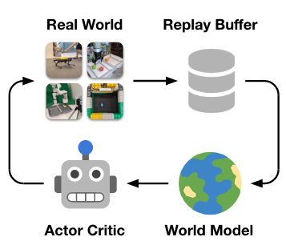
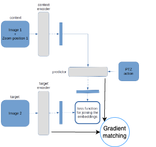
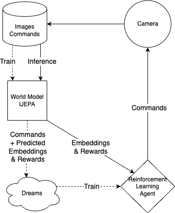
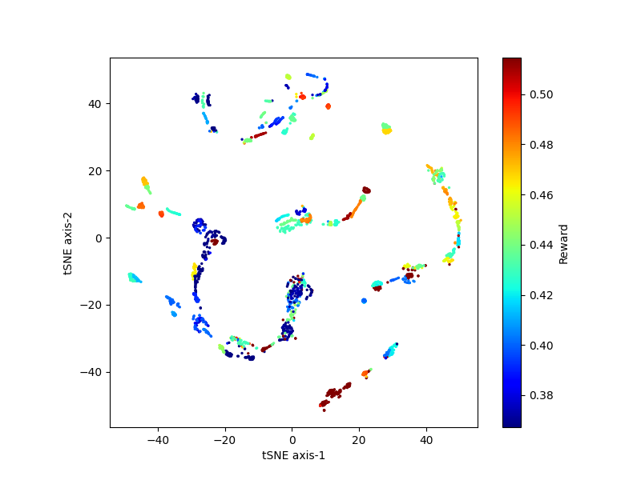
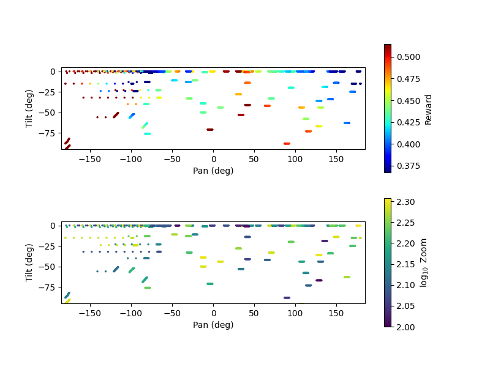
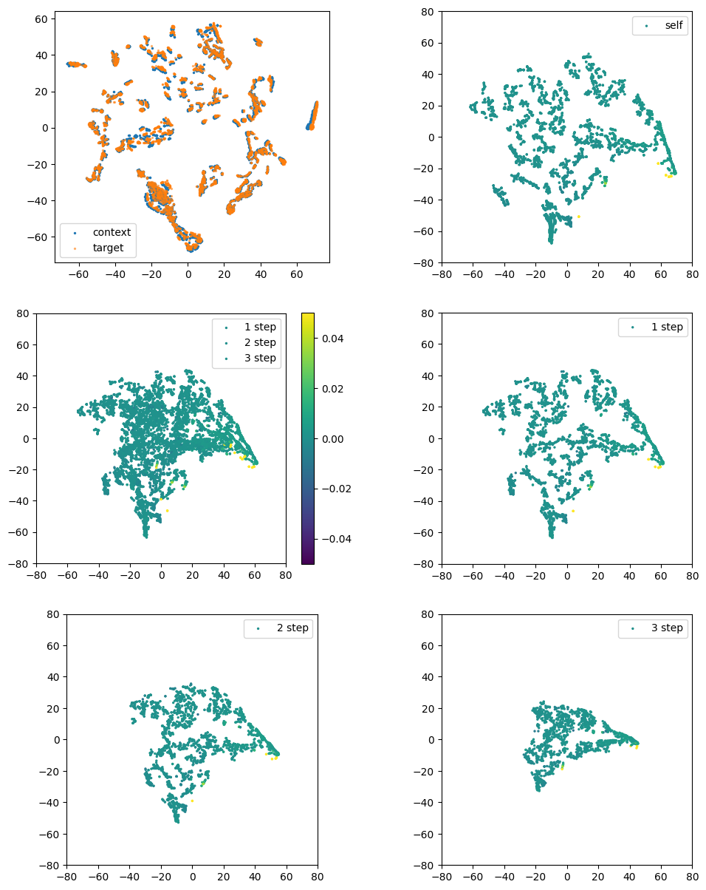

# An Autonomous Camera Control System Inspired by Curiosity

Author: Yufeng Luo, MCS Research Aide, University of Wyoming, Summer 2024

## Introduction

The combination of computer vision (CV) and reinforcement learning (RL) has proven to have great potential, such as self-driving cars and autonomous robots.
Many of those systems are inspired by human physiological or psychological phenomena, such as brain cortex structure, reasoning step, action motivation, etc.

We are interested in exploring the capability of those combined systems in an edge computing environment using the SAGE framework with limitations on computing resources and communication bandwidth.
Many SAGE nodes are in a wild environment, so the surroundings have dynamic and diverse image features.
Inspired by human infant's eye movement to capture new information[[3](#references)], we aim to design a CV + RL system that coevolves with the camera’s surroundings and brings unexpected and extraordinary information such as wild fire, lightning strikes, etc.

Thanks to the recent development in vision transformer and its frameworks, the Image-Joint Embedding Predictive Architecture (I-JEPA) [[1](#references)] has been shown great capability for diverse computer vision tasks in self-supervised learning.
We chose I-JEPA for our CV task.
For the reinforcement learning, we used the recent framework DayDreamer [[2](#references)].
We combined the CV and RL tasks together using a reward function that is inspired by curiosity of human beings.
That is, given a current image, the CV system is asked to give a score of the image based on the information it has learned and collected so far.
The more diverse, more unpredictable the image is, the higher the score should be.
This score is the reward fed into RL agent.
With this score, the CV system will guide the RL agent to capture pictures on areas that are harder to predict, driven by the maximal information entropy (or curiosity).

Our computing hardware is a Dell blade with Tesla T4 GPU.
We use Pan Tilt Zoom (PTZ) cameras to capture images.
The cameras have full 360 degree pan angle range, but have limited tile angle range due to the mounting of the camera.

We will present the current progress on building the system, focusing on some difficulties in the designing process and diagnostics.
We will also highlight future possibilities using federated learning with a network of cameras.

## Method

In section, we will discuss details about the CV and RL framework for this project.
The overall framework follows the steps in the DayDreamer workflow as shown in figure 1.
The I-JEPA acts as the World Model, and RL agent is trained in the actor critic section.
We will show a modified figure in the later state with details about our modifications and rationales.

||
|:--:|
|*Figure 1. workflow of DayDreamer [[2](#references)]*|

### World Model: Image-Joint Embedding Predictive Architecture (I-JEPA)

I-JEPA [1] is a self-supervised learning framework that learns to predict the patches of an image by embedding the image into a joint space with a predictive model.
Since the I-JEPA framework takes an input latent variable *z*, we use the command of camera as the input.
The modification is shown in the figure below.

||
|:--:|
|*Figure 2. World Model Architecture*|

An image (image 1 in figure 1) and the relative PTZ position associated with it are fed as input to the context encoder.
Relative PTZ positions are obtained from absolute PTZ position with a small perturbation on pan angle.
This perturbation is to prevent model from merely memorizing the positions of few prominent objects rather than learning the general context and object in order to understand the general surrounding with diverse features.

For target encoder, another image (image 2) and its relative PTZ is fed and the embedding is generated. The relative PTZ position of the pair of the images are perturbed by the same amount (i.e., the relative position of these images are invariant).

Then, the predictor is taken the embedding from the context encoder, the relative PTZ for images the context and target encoders, and is asked to perform two predictions:
1. predict the embedding from target encoder
2. predict the context encoder gradient after learning information from image 2

The loss of the ML framework is:
$$\ell_{total} = \ell_{joint-embed}+\ell_{grad}$$

where the two parts of the loss are

- The joint embedding loss to ensure the encoders can learn semantic information from the images 
$$\ell_{joint-embed}=||S_{Contx-Encoder} - S_{Target-Encoder}||$$
- The gradient predicting loss to capture the difficulty of predicting the next images based on current information 
$$\ell_{grad}=||\nabla_{CE, pred} - \nabla_{CE, gt}||$$

The world model essentially learns the semantic information in the surrounding, and understand how hard it would be to predict new images given the current knowledge accumulated from the past training. Context, target encoders and predictor are constructed from a vision transformer.

### RL Agent: Training with DayDreamer

The RL agent is presented as the actor critic in figure 1. The agent is trained on the reward given by the world model. The reward is defined as the gradient of the context encoder $\nabla_{CE}$ as shown in the equation above. The idea is that the higher the context encoder gradient is, the harder the model struggles to predict the next image. The gradient of the context encoder represents the surprise of the information for the image.

The agent is then guided by the reward and output commands to move the camera to take images where the reward is expected to be higher. That is, the agent is driven to take images can surprise it, which is the "curiosity" as we defined.

The agent will be connected to the context encoder of the world model selected, and specify a series of actions to move the camera. The agent will follow the same world model for a period of time (such as a generation) to focus on certain features. We also introduced stochasticity to the process by alternatively sampling the action from a binominal distribution on certain occasion using acceptance rejection algorithm. (Draw a number from a uniform distribution in range [0, 1], if number is greater than 0.9, use the sampled action, otherwise use action given by the agent).

### General Workflow

Putting the world model and the RL agent together, the whole workflow is described in figure 3.

||
|:--:|
|*Figure 3. System Workflow. Different paths are highlighted with solid and dashed lines. The inference and image gathering process is in solid while the training path is in dashed line*|

The two paths highlighted in the figure represent the two modes the system will operate on -- training, image gathering. In the training process, a world model is first trained and then an agent is trained based on input from that trained world model.

The detailed model training procedure is outlined as follows:

1. a world model is randomly selected to be trained with pre-capture images (either from last cycle of running process or from images gather with random commands if at beginning of the whole session at birth).
2. a world model is randomly selected to generate dreams from the images used in step 1.
3. an agent model is randomly chosen to be trained with dreams generated by a random world model
4. an agent model is randomly chosen to operate the camera and capture images to train world model in step 1.

The random world models in step 1 and 2 are not necessarily the same model, neither are the agents in step 3 and 4.

One important feature is that we are running N pairs of world models and agents together, where N is defined by user. The results of different values of N will be discussed in the section below. Since models are initialized randomly and therefore might pay more attention to different things, many pairs of models can ensure the models can cover a range of attentions with different information. Eventually, the information will be spread among different models to reach a common sense of the surrounding thanks to the switching between pairs with images containing diverse information.

## Model Training and Analysis

The training and inference cycle is run in lifelong mode that the process is to run indefinitely. The model will be stopped either after the loss curve reaches a plateau or the number of epochs defined by used is reached. To clarify the whole lifelong learning process, we have following concepts to quantify the procedure:

- epoch: specify the image set for current training (eg. 20 iterations * 30 movements/iteration = 600 images)
- restart: model restarts from the previous plateau
- generation: model restarted after N times and it has reached the maximum epochs. This model is removed and a new model was spawned to replace the older one. (We called it the aging process)
- model number: this is the unique ID for this model. It serves as a random seed for the model configuration

With those concepts defined, each model is fully trackable on its training journey, so we can do future analysis on the learning results. An ideal scenario is to perform an ablation study to understand what information the model has learned in its lifetime.

The diagnostics are collected during the image gathering phase in lifelong training. The diagnostics include embeddings from the context encoder, the predicted action for the camera movement, and the absolute positions of the camera. These three diagnostics help to trace the action sequence of the camera and explain the behaviors the agent performs.

## Result and Discussion

We have selected a demo case for the lifelong learning process. The world model is `wm_00_00` and the agent is `ag_00_02` using AXIS camera.From figure 4., world model has been restarted for 3 times (excluding the last red line where the training ends) and the spikes in the restart 3 shows that there are some information the model is trying to learn. We expect the oscillation in the final loss curve caused by the Exponential Mean Average (EMA) update on the target encoder, where the target encoder is trying to share information with via the EMA update.

||
|:--:|
|*Figure 4. Loss curve for wm_00_00. Red dashed line marks the restart*|

||
|:--:|
|*Figure 5. tSNE plot for the target encoder embeddings collected during image gathering phase. The clusters are distinct from each other with different rewards*|

||
|:--:|
|*Figure 6. absolution positions of the camera with reward and zoom values. The agent has different moving strategies for different parts of the surrounding. It has a larger steps on the left, while choosing much smaller steps on the right side of the pan range.*|

||
|:--:|
|*Figure 7. 3D presentation of camera absolution positions with rewards*|

||
|:--:|
|*Figure 8. Target, context and predictor embeddings with rewards. The top left panel shows the comparison of embeddings between context and target encoders. They overlap each other, which means target and context encoder shares similar information, as expected. The other five panels display the predictor embeddings given image pairs in a batch size of four. Steps are the number of actions between the pair of images and the reward assigned with the pair. The rewards are similar in range, but has a clear cluster and shape in the tSNE plot.*|

The CV + RL system trained using DayDreamer workflow in lifelong learning mode has displayed show some interesting behaviors such as different step sizes, changing directions in various zones of the surrounding. On the other hand, it doesn't perform well on distinguishing areas with good and bad rewards. This issue could be due to the complexity of the environment and thus model does not have enough information to draw a boundary between more and less feature-rich area driven by curiosity.
To fully understand the behavior and explain the choices by the agent from a statistical perspective requires more detailed analyses.

This project's inspiration comes from infant's attention mechanism and we are aiming to reproduce some similar behaviors in the paper[[3](#references)] where more attention is paid to specific area. And thus, building a connection between the cyberphycial AI and biology reasoning. This, however, can possess some complex on how we evaluate the final results. With the current project, we hope to shed some light into this understanding the connection and develop future physical AI system based on biology inspirations.

## Acknowledgement

I would like to thank my mentor Dr. Dario Dematties for many inspiring conversations and insightful advice. I would also express my gratitude to Dr. Raj Sankaran and Dr. Yongho Kim for their technical support on the camera and server systems. Finally, I want to thank SAGE team for providing this unique opportunity to let me explore in the realm of cyberphysical AI and edge computing! I have learned a lot this summer, once again!

## References

1. Assran et al., Self-Supervised Learning from Images with a Joint-Embedding Predictive Architecture
2. Wu et al., DayDreamer: World Models for Physical Robot Learning
3. Tomalski et al., Selective Changes in Complexity of Visual Scanning for Social Stimuli in Infancy
